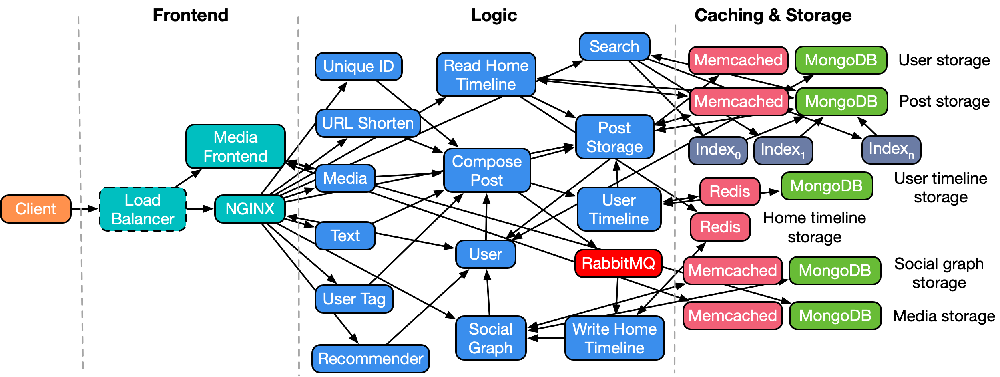
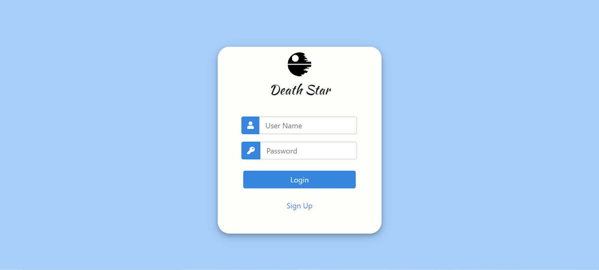
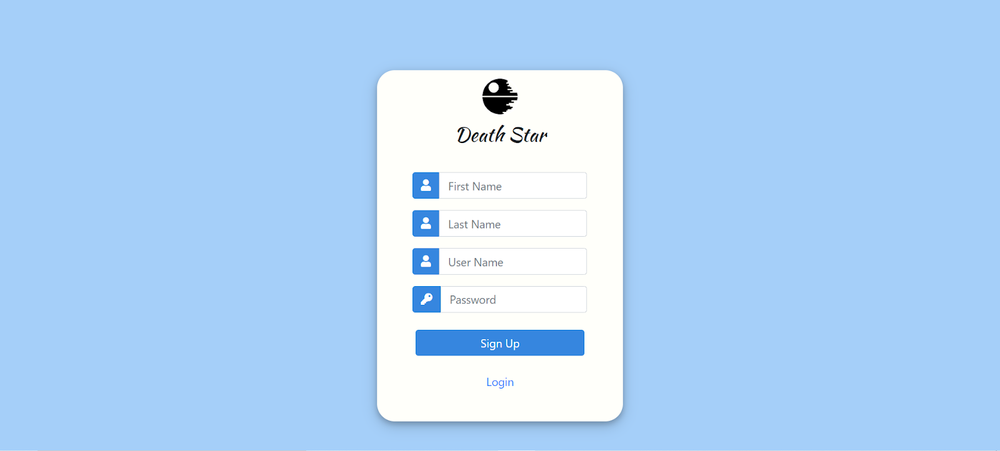
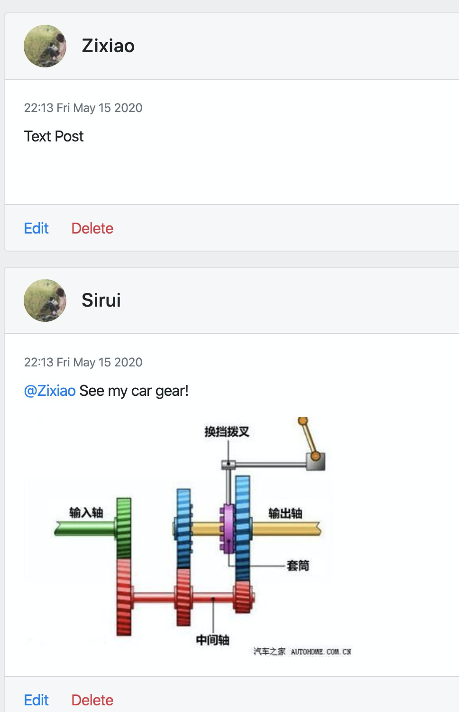
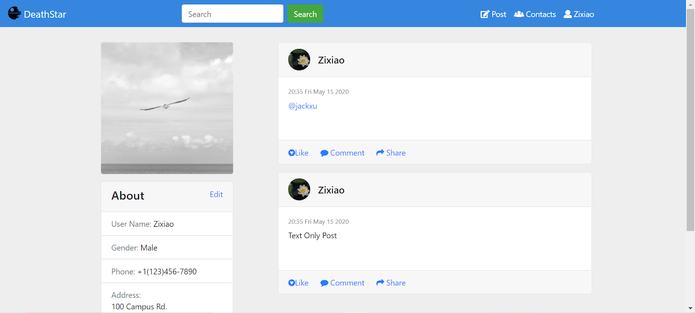
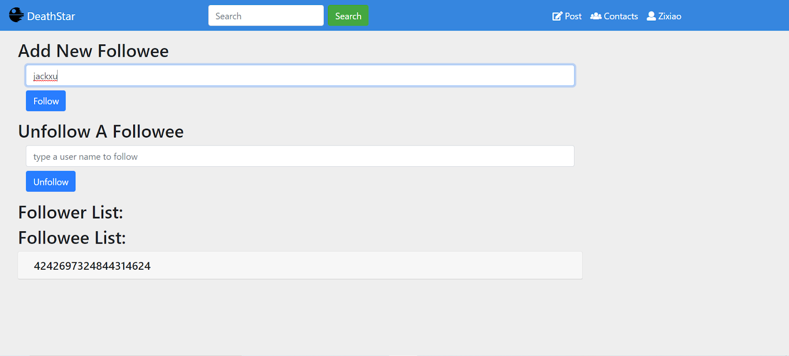

# DeathStarBench

Open-source benchmark suite for cloud microservices. DeathStarBench includes five end-to-end services, four for cloud systems, and one for cloud-edge systems running on drone swarms. 

## End-to-end Services 

* Social Network (released)
* Media Service (released)
* Hotel Reservation (released)
* E-commerce site (in progress)
* Banking System (in progress)
* Drone coordination system (in progress)

## License & Copyright 

DeathStarBench is free software; you can redistribute it and/or modify it under the terms of the GNU General Public License as published by the Free Software Foundation, version 2.

DeathStarBench is being developed by the [SAIL group](http://sail.ece.cornell.edu/) at Cornell University. 

## Publications

More details on the applications and a characterization of their behavior can be found at ["An Open-Source Benchmark Suite for Microservices and Their Hardware-Software Implications for Cloud and Edge Systems"](http://www.csl.cornell.edu/~delimitrou/papers/2019.asplos.microservices.pdf), Y. Gan et al., ASPLOS 2019. 

If you use this benchmark suite in your work, we ask that you please cite the paper above. 


## Beta-testing

If you are interested in joining the beta-testing group for DeathStarBench, send an email at: <microservices-bench-L@list.cornell.edu>


# Social Network Microservices

A social network with unidirectional follow relationships, implemented with loosely-coupled microservices, communicating with each other via Thrift RPCs. 

## Application Structure



Supported actios: 
* Create text post (optional media: image, video, shortened URL, user tag)
* Read post
* Read entire user timeline
* Receive recommendations on which users to follow
* Search database for user or post
* Register/Login using user credentials
* Follow/Unfollow user

## Pre-requirements
- Docker
- Docker-compose
- Python 3.5+ (with asyncio and aiohttp)
- libssl-dev (apt-get install libssl-dev)
- libz-dev (apt-get install libz-dev)
- luarocks (apt-get install luarocks)
- luasocket (luarocks install luasocket)

## Running the social network application
### Before you start
- Install Docker and Docker Compose.
- Make sure the following ports are available: port `8080` for Nginx frontend, `8081` for media frontend and 
  `16686` for Jaeger.

### Start docker containers
Start docker containers by running `docker-compose up -d`. All images will be 
pulled from Docker Hub.

### Register users and construct social graphs
Register users and construct social graph by running 
`python3 scripts/init_social_graph.py`. This will initialize a social graph 
based on [Reed98 Facebook Networks](http://networkrepository.com/socfb-Reed98.php),
with 962 users and 18.8K social graph edges.

### Running HTTP workload generator
#### Make
```bash
cd wrk2
make
```

#### Compose posts
```bash
cd wrk2
./wrk -D exp -t <num-threads> -c <num-conns> -d <duration> -L -s ./scripts/social-network/compose-post.lua http://localhost:8080/wrk2-api/post/compose -R <reqs-per-sec>
```

#### Read home timelines
```bash
cd wrk2
./wrk -D exp -t <num-threads> -c <num-conns> -d <duration> -L -s ./scripts/social-network/read-home-timeline.lua http://localhost:8080/wrk2-api/home-timeline/read -R <reqs-per-sec>
```

#### Read user timelines
```bash
cd wrk2
./wrk -D exp -t <num-threads> -c <num-conns> -d <duration> -L -s ./scripts/social-network/read-user-timeline.lua http://localhost:8080/wrk2-api/user-timeline/read -R <reqs-per-sec>
```

#### View Jaeger traces
View Jaeger traces by accessing `http://localhost:16686`

Example of a Jaeger trace for a compose post request: 


#### Use Front End
After starting all containers using `docker-compose up -d`, visit `http://localhost:8080` to use the front end.

First you could see the login and signup page:



In order to load default users into database, visit `http://localhost:8080/main.html` once. Then click compose to post new contents.

After composing a few posts, you could see your own posts in user timeline page. Click follow button on the right side to follow defualt users:


To see your own posts in home timeline page, click the username and profile button:


Posts could be mixed with text, user mention and image.

Click the contact button to follow/unfollow other users; follower/followee list would be shown below in form of user-id:


### Development Status

This application is still actively being developed, so keep an eye on the repo to stay up-to-date with recent changes. 

#### Planned updates

* Upgraded recommender
* Upgraded search engine 

### Questions and contact

You are welcome to submit a pull request if you find a bug or have extended the application in an interesting way. For any questions please contact us at: <microservices-bench-L@list.cornell.edu>

